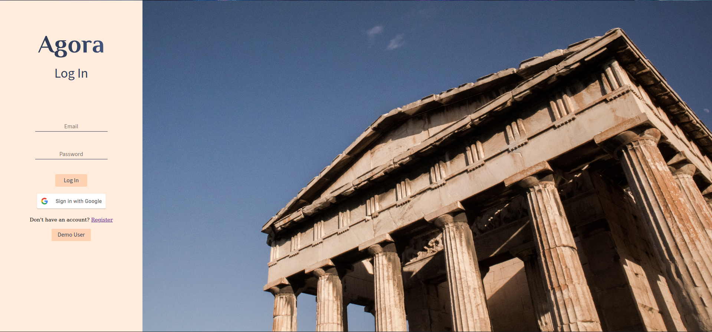
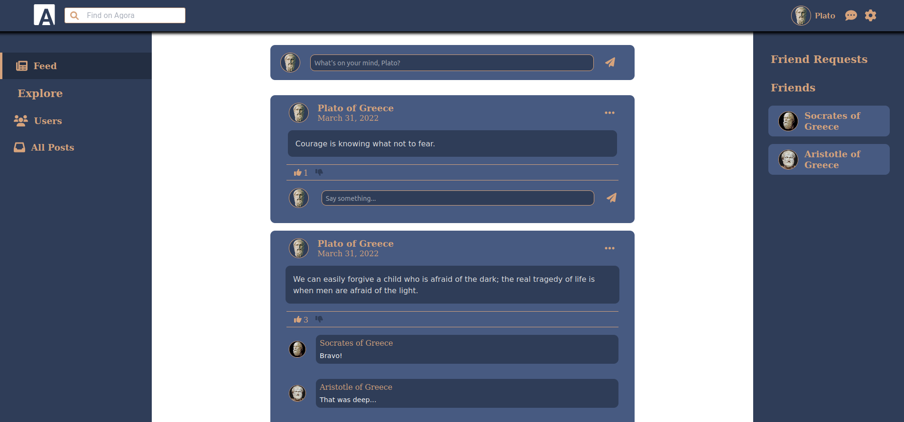

Agora is fullstack social media app built using MongoDB, Express, React, and NodeJS!
<pre>

</pre>
Click the link for a live demo!
[https://agora-atlas.herokuapp.com](https://agora-atlas.herokuapp.com)
<pre>

</pre>
Agora's features include:
* creating an account
* login with google via oauth2
* creating, updating, and deleting posts 
* commenting on existing posts
* updating and deleting comments
* liking and disliking posts
* adding/removing friends
* viewing only posts of user and friends of user (feed/timeline)
* viewing all posts from all users
* viewing a single post
* an autocomplete search bar for looking up users
* ability to change profile pictures
<pre>

</pre>
The backend was built using express with nodeJS and features:
* being a rest api with resource endpoints
* fully authenticated via passportjs
* fully authorized with jwt tokens sent via http-only cookies

